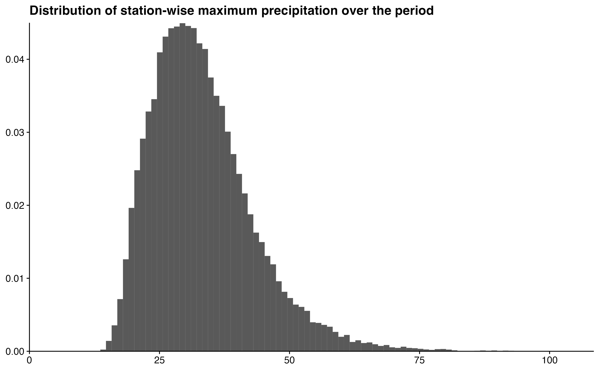
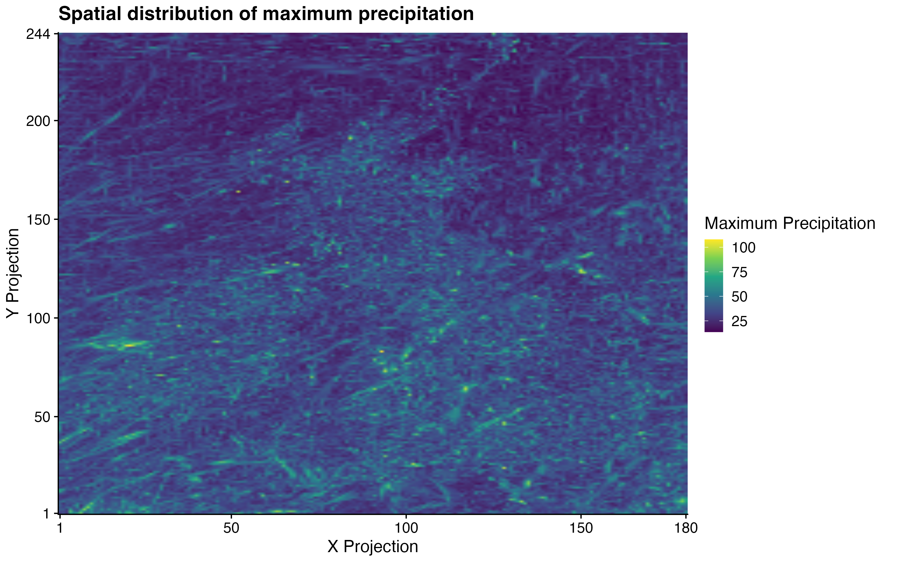
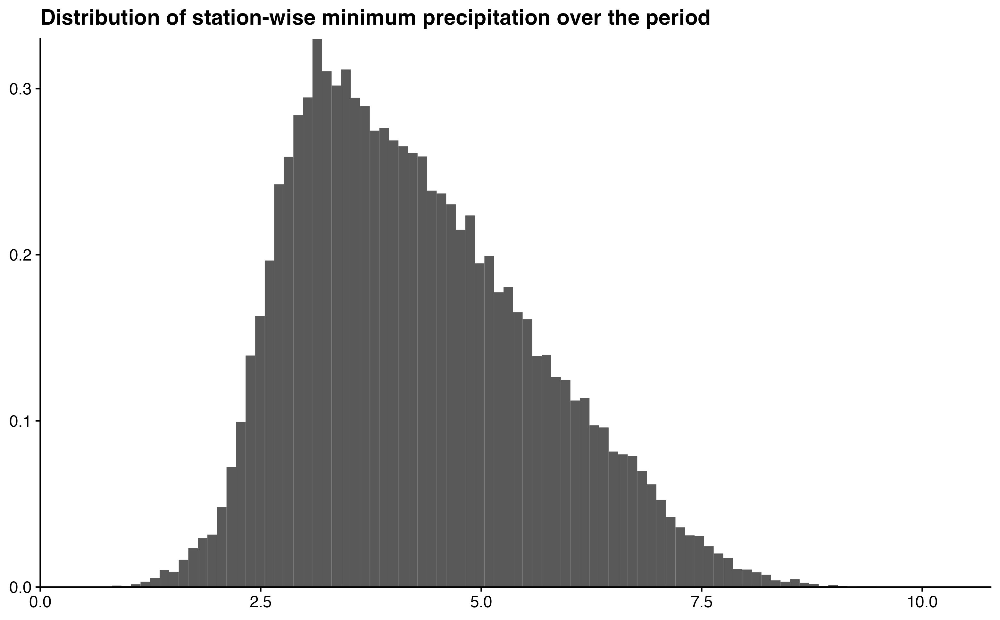
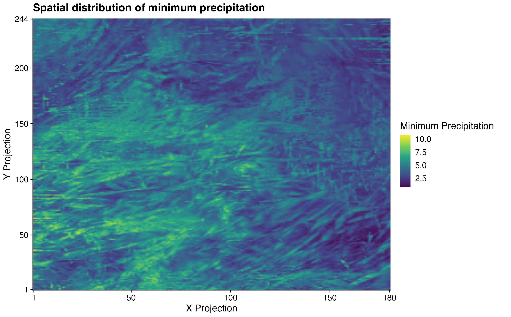

```{r, include = FALSE}
knitr::opts_chunk$set(
  collapse = TRUE,
  comment = "#>",
  fig.width = 10,
  out.width = "100%",
  echo = FALSE,
  fig.asp = 0.621,
  message = FALSE,
  warning = FALSE
)

```

```{r}
#| message: false
#| warning: false
options(rmarkdown.html_vignette.check_title = FALSE)
library(bggjphd)
library(tidyverse)
library(GGally)
library(cowplot)
theme_set(theme_half_open())
```

# Summary

The data used in this research are downloaded from the CEDA Archive:

* [UKCP Local Projections on a 5km grid over the UK for 1980-2080](https://data.ceda.ac.uk/badc/ukcp18/data/land-cpm/uk/5km)

The raw data contain climate projections for the UK on a 5km grid from 1980 to 2080 for a high emissions scenario, *RCP8.5*, and contain hourly precipitation rates of $43.920$ squares on a $180 \times 244$ grid. The projections are calculated for $1980 - 2000$, $2020 - 2040$, and $2060 - 2080$, thus giving $60 \times 365 \times 24 \times 180 \times 244 \approx 24 \cdot 10^9$ data points. 

The raw data were processed by calculating the yearly maximum over the hourly precipitation rates for each station, thus reducing the number of data points to $60 \times 180 \times 244 \approx 2.6 \cdot 10^6$.

# Summary statistics

## Maximum precipitation

```{r}
#| eval: false
p <- full_data |> 
  ggplot(aes(max_precip, y = after_stat(density))) +
  geom_histogram(bins = 100) +
  scale_x_continuous(
    limits = c(0, NA),
    expand = expansion()
  ) +
  scale_y_continuous(
    expand = expansion()
  ) +
  labs(
    x = NULL,
    y = NULL,
    title = "Distribution of station-wise maximum precipitation over the period"
  )

ggsave(
  plot = p,
  filename = "Figures/figure1.png",
  width = 8, height = 0.621 * 8, scale = 1.3
)
```



```{r}
#| eval: false
p <- full_data |> 
  ggplot(aes(proj_x, proj_y, fill = max_precip)) +
  geom_raster(
    interpolate = TRUE
  ) +
  scale_x_continuous(
    expand = expansion(),
    breaks = c(range(full_data$proj_x), pretty(full_data$proj_x))
  ) +
  scale_y_continuous(
    expand = expansion(),
    breaks = c(range(full_data$proj_y), pretty(full_data$proj_y))
  ) +
  scale_fill_viridis_c() +
  theme(
    # legend.position = "top",
    plot.margin = margin(t = 5, r = 25, b = 5, l = 5)
  ) +
  labs(
    x = "X Projection",
    y = "Y Projection",
    fill = "Maximum Precipitation",
    title = "Spatial distribution of maximum precipitation"
  )

ggsave(
  plot = p,
  filename = "Figures/figure2.png",
  width = 8, height = 0.621 * 8, scale = 1.3
)
```



## Minimum precipitation

```{r}
#| eval: false
p <- full_data |> 
  ggplot(aes(min_precip, y = after_stat(density))) +
  geom_histogram(bins = 100) +
  scale_x_continuous(
    limits = c(0, NA),
    expand = expansion()
  ) +
  scale_y_continuous(
    expand = expansion()
  ) +
  labs(
    x = NULL,
    y = NULL,
    title = "Distribution of station-wise minimum precipitation over the period"
  )

ggsave(
  plot = p,
  filename = "Figures/figure3.png",
  width = 8, height = 0.621 * 8, scale = 1.3
)
```




```{r}
#| eval: false
p <- full_data |> 
  ggplot(aes(proj_x, proj_y, fill = min_precip)) +
  geom_raster(
    interpolate = TRUE
  ) +
  scale_x_continuous(
    expand = expansion(),
    breaks = c(range(full_data$proj_x), pretty(full_data$proj_x))
  ) +
  scale_y_continuous(
    expand = expansion(),
    breaks = c(range(full_data$proj_y), pretty(full_data$proj_y))
  ) +
  scale_fill_viridis_c() +
  theme(
    # legend.position = "top",
    plot.margin = margin(t = 5, r = 25, b = 5, l = 5)
  ) +
  labs(
    x = "X Projection",
    y = "Y Projection",
    fill = "Minimum Precipitation",
    title = "Spatial distribution of minimum precipitation"
  )
ggsave(
  plot = p,
  filename = "Figures/figure4.png",
  width = 8, height = 0.621 * 8, scale = 1.3
)
```




# Example data

```{r}
#| fig.asp: 0.8
#| echo: false
precip |> 
  filter(station <= 10) |> 
  mutate(
    period = case_when(
      year <= 2000 ~ "1980 - 2000",
      year <= 2040 ~ "2020 - 2040",
      year <= 2080 ~ "2060 - 2080",
    )
  ) |> 
  ggplot(aes(year, precip)) +
  geom_line(aes(group = station)) +
  facet_wrap("period", ncol = 1, scales = "free_x") +
  labs(
    x = NULL,
    y = NULL,
    title = "Maximum hourly precipitation for ten stations",
    subtitle = "Shown for each of the three modelled periods"
  )
```
